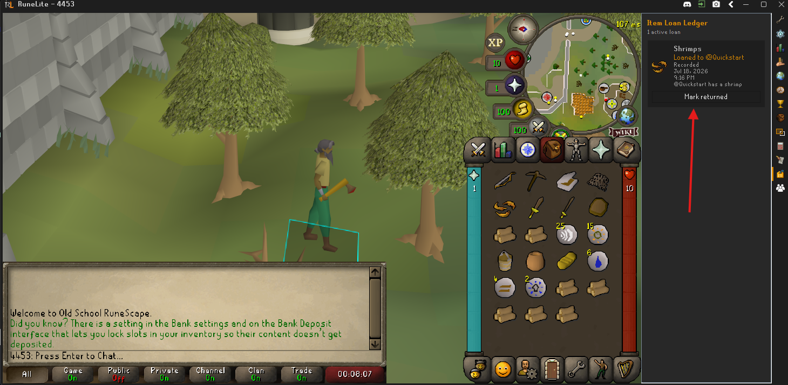
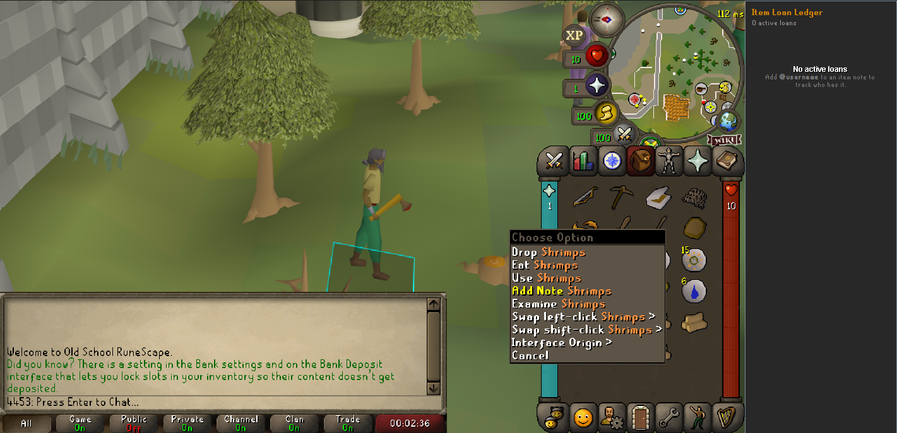
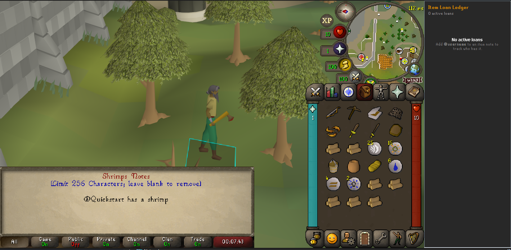
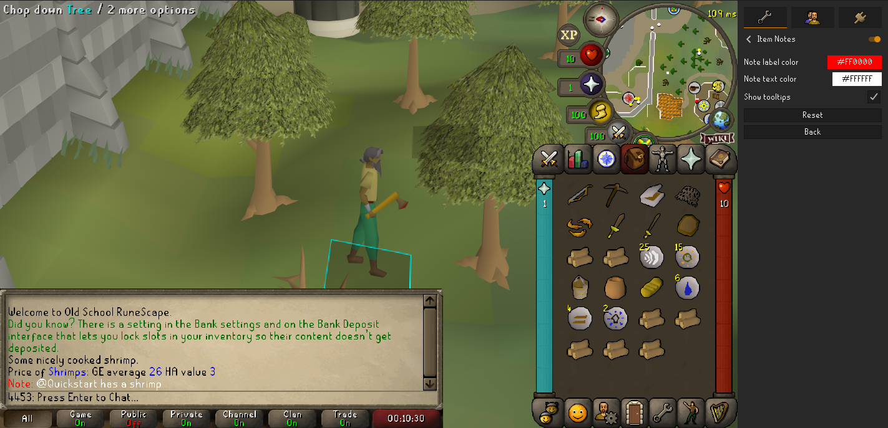
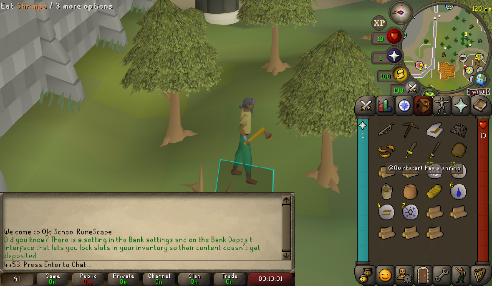
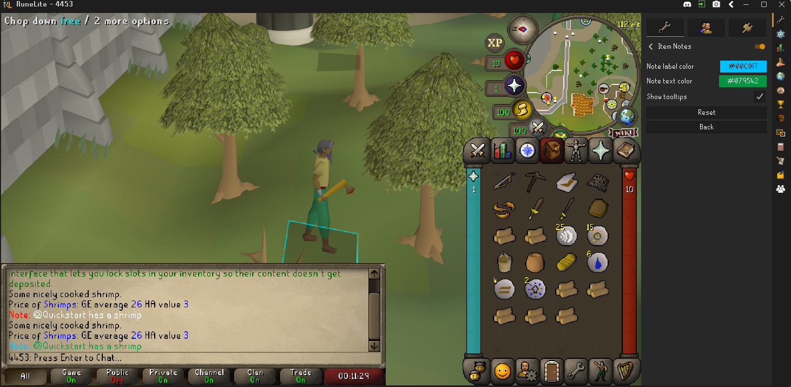
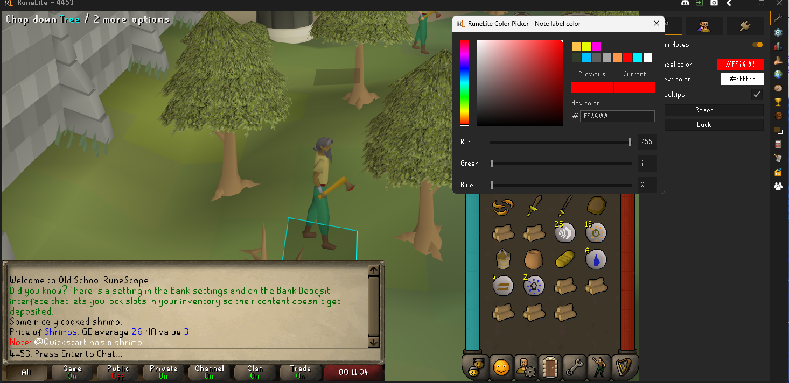
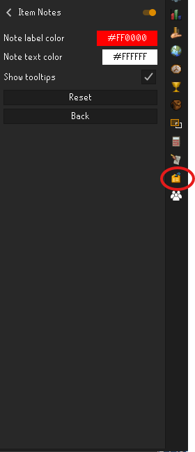

# Item Notes for RuneLite

Item Notes lets you attach private, persistent notes to RuneScape items and maintain a lightweight local loan ledger. Notes follow the canonical item across inventory, bank, equipment, Grand Exchange, and other item interfaces.



## Features

- Add or edit a note by holding **Shift** and right-clicking an item.
- See saved notes in item hover tooltips and after examining the item.
- Customize the `Note:` label and note text with independent color pickers or hex codes.
- Add `@username` to a note to create an active entry in the Item Loan Ledger.
- Record the local date and time when a borrower is tagged.
- Mark loans as returned while preserving the remaining note text.
- Share notes between noted/unnoted and dose/charge variants through canonical item IDs.
- Store all data privately in the local RuneLite configuration profile.

## Usage

1. Hold **Shift** and right-click an item.
2. Choose **Add Note** or **Edit Note**.
3. Enter up to 256 characters and press Enter.
4. To track a loan, include a tag such as `@Quickstart has a shrimp`.
5. For RuneScape names containing spaces, use underscores: `@Clan_Mate` is displayed as `@Clan Mate` in the ledger.
6. Open the Item Notes sidebar to review active loans or mark one returned.

Leaving the editor blank removes the note. Removing the `@username` tag removes the active loan record.

## Screenshots

| Add a note | Tag a borrower |
| --- | --- |
|  |  |

| Examine output | Hover tooltip |
| --- | --- |
|  |  |

| Loan ledger | Color settings |
| --- | --- |
|  |  |

| Color picker | Sidebar icon |
| --- | --- |
|  |  |

## Privacy and scope

Item Notes is intentionally local-only. It performs no network requests, does not inspect or publish clan rosters, does not verify tagged usernames, and does not send or modify game chat. A username in a note is private text entered by the user, not crowdsourced player data.

The loan ledger is a personal recordkeeping aid. Quantities, due dates, and loan terms are free-form note text, and the plugin does not verify ownership or enforce agreements.

## Development

This repository follows RuneLite's standalone external-plugin structure and targets Java 11.

```shell
./gradlew test
./gradlew run
```

On Windows, use `gradlew.bat`. The `run` task launches RuneLite in developer mode. Jagex Account users should follow RuneLite's [Using Jagex Accounts](https://github.com/runelite/runelite/wiki/Using-Jagex-Accounts) development instructions.

## License

Item Notes is licensed under the BSD 2-Clause License. See [LICENSE](LICENSE).
