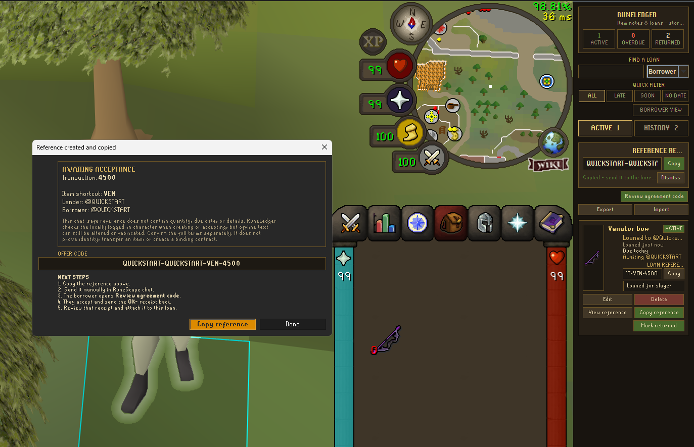
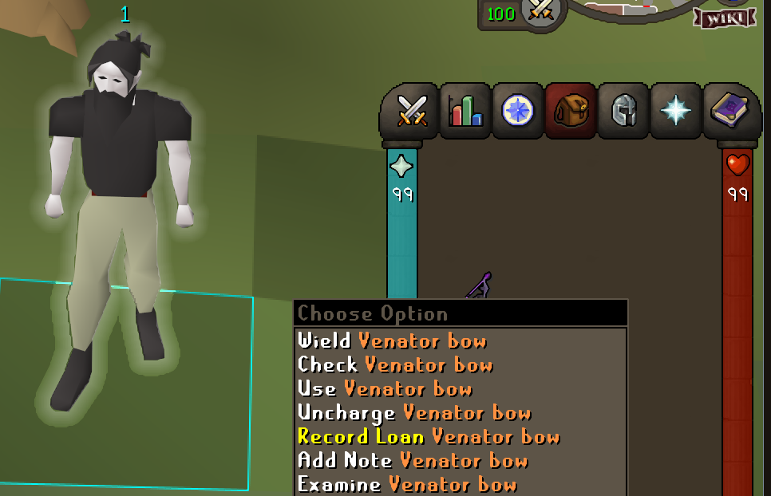
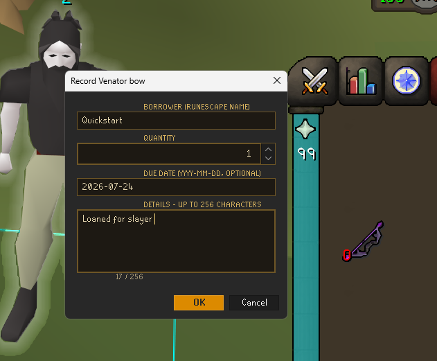
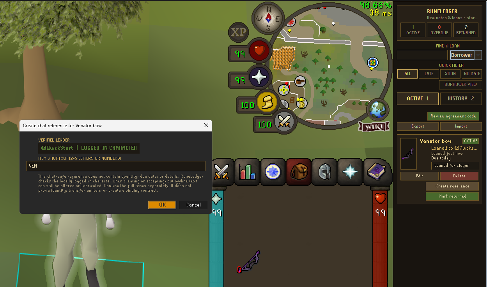
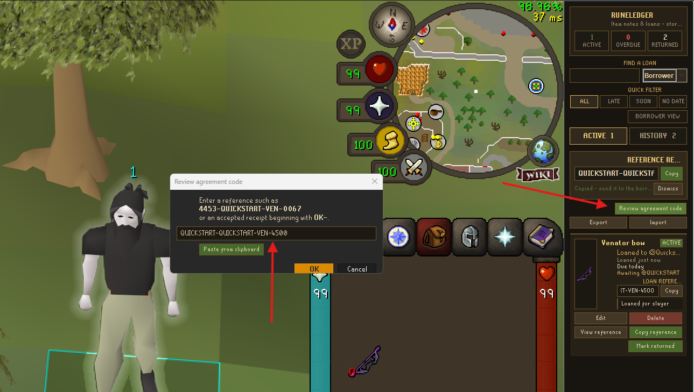
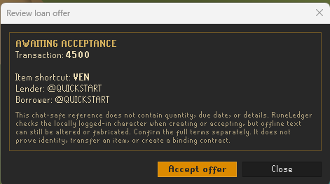
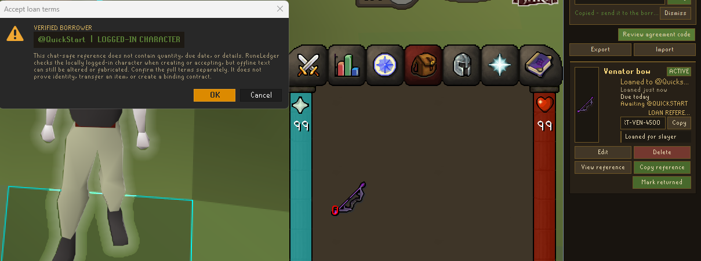
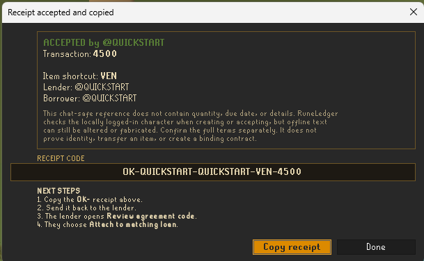

# RuneLedger: Item Notes & Loans for RuneLite

RuneLedger lets you attach private, persistent notes to RuneScape items and track borrowed items in a lightweight local loan ledger. Notes follow the canonical item across inventory, bank, equipment, Grand Exchange, and other item interfaces.

> **Development preview:** this repository contains the version being reviewed and tested. It has not been submitted to the official RuneLite Plugin Hub.



## What changed in this update

### Item notes remain quick and private

- Hold **Shift** and right-click an item to add, edit, or remove a note.
- View saved notes in hover tooltips and after examining the item.
- Notes follow canonical item IDs, including compatible noted/unnoted and dose or charge variants.
- Customize the `Note:` label and note text independently with RuneLite color pickers or hex colors.
- Use up to 256 characters, with a live character counter in the editor.

### The loan ledger is now a complete workspace

- Record the borrower, quantity, optional due date, and private details.
- Track multiple independent loans for the same item.
- See active, overdue, and returned totals at the top of the sidebar.
- Search by borrower or item and sort by borrower, age, due date, or return time.
- Filter active loans by **All**, **Late**, **Soon**, or **No date**.
- Switch to **Borrower view** to group loans by player and total outstanding quantity.
- Mark loans returned, reopen them, delete them, or undo a return.
- Keep returned records in a separate history instead of losing the audit trail.
- Optionally receive one overdue-loan reminder after logging in.

### Short reference and acceptance flow

- Create a compact, chat-safe reference such as `4453-QUICKSTART-VEN-0067`.
- Automatically use the character logged into the lender's RuneLite client; the lender field cannot be edited.
- Let the named borrower review the reference and accept only while logged into the matching character.
- Generate an `OK-` receipt such as `OK-4453-QUICKSTART-VEN-0067`.
- Keep the code visible in a persistent **Reference ready** banner and on the loan card.
- Copy from the result dialog, banner, or full-size **Copy reference** card button.
- Attach the returned receipt only while logged into the lender named in the code.
- Allow anyone holding a code to inspect its displayed parties, item shortcut, transaction number, and status.

### Safer storage and recovery

- Store notes, loans, references, and receipts in the current local RuneLite profile.
- Export the complete notes-and-loans dataset to a local JSON backup.
- Import a backup with validation, counts, and confirmation before replacing matching records.
- Preserve the existing `itemNotes` configuration group and migrate older tagged notes automatically.

## Reference format

An offer uses four short sections:

```text
LENDER-BORROWER-ITEM-TRANSACTION
4453-QUICKSTART-VEN-0067
```

An accepted receipt adds `OK-`:

```text
OK-4453-QUICKSTART-VEN-0067
```

The item shortcut is 2–5 letters or numbers, and the transaction number is four digits. Spaces in names become underscores and hyphens inside names become `~` so the sections stay readable.

The reference deliberately excludes quantity, due date, and private details. Both players should confirm those full terms separately before accepting.

## Lender walkthrough

### 1. Start a loan from the item

Hold **Shift**, right-click the item, and choose **Record Loan**. **Add Note** remains available when only a private item reminder is needed.



### 2. Record the full terms

Enter the borrower's RuneScape name, quantity, optional due date, and any private details. The character counter shows how much detail space remains.



### 3. Create a reference as the logged-in lender

Open RuneLedger and choose **Create reference** on the loan card. RuneLedger reads the local logged-in character and shows it as **Verified lender**; it is not an editable text field. Confirm or change the short item code.



If no character is logged in, reference creation is blocked. This prevents the normal plugin flow from claiming a different lender name.

### 4. Copy and send the offer

After creation, RuneLedger:

- attempts to copy the reference automatically;
- shows the complete code in a guided result window;
- keeps it in the **Reference ready** banner;
- displays it on the loan card; and
- provides persistent **View reference** and **Copy reference** actions.


Send the reference manually through RuneScape chat or another messaging service. RuneLedger never types into or modifies game chat.

## Borrower walkthrough

### 5. Open the shared reference

On the borrower client, choose **Review agreement code**, then type the short reference or use **Paste from clipboard**.



### 6. Review before accepting

RuneLedger displays the lender, borrower, item shortcut, transaction number, and the reference limitations before presenting **Accept offer**.



### 7. Verify the borrower character

Acceptance checks the character logged into that local RuneLite client. The account must match the borrower named in the reference; otherwise RuneLedger blocks acceptance and asks the user to switch characters.



### 8. Copy the accepted receipt

Acceptance creates the matching `OK-` receipt, attempts to copy it, and explains how to return it to the lender.



The lender then opens **Review agreement code**, pastes the returned `OK-` receipt, and chooses **Attach to matching loan**. RuneLedger requires the lender character named in the receipt to be logged in before attachment.

## Everyday ledger use

- Add `@username` to an ordinary note as a quick way to create a linked active loan.
- Use underscores for spaces in note tags: `@Clan_Mate` is displayed as `@Clan Mate`.
- Editing the borrower, quantity, due date, or details invalidates an existing reference because its terms changed.
- Marking a linked loan returned removes the active `@username` tag while preserving the borrower's name in the note.
- Removing an active `@username` tag moves its linked loan into history.
- Leaving the note editor blank removes that item note.

## Backup and restore

Use **Export** and **Import** at the bottom of the sidebar to back up or merge private records. Imports are validated before use. Notes or loan records with the same item or loan ID are replaced only after confirmation. Display colors and other plugin preferences are not included in the backup.

## Other item-note views

| Add a note | Tag a borrower |
| --- | --- |
|  |  |

| Examine output | Hover tooltip |
| --- | --- |
|  |  |

| Color settings | Color picker |
| --- | --- |
|  |  |


## Privacy, identity checks, and limitations

RuneLedger is intentionally local-only. It performs no network requests, does not inspect or publish clan rosters, and does not send or modify game chat. A username in an ordinary note remains private text entered by the user, not crowdsourced player data. Reference creation and acceptance compare the named party with the character logged into that local RuneLite client.

The logged-in-character check prevents accidental or dishonest name substitution through RuneLedger's normal buttons. It does not make the shared code cryptographically signed. Because the code is offline text, someone could still fabricate or alter one outside RuneLedger.

RuneLedger is a personal recordkeeping and handoff aid. A reference or receipt does not globally authenticate a RuneScape account, prove an item transfer, verify ownership, enforce repayment, or create a legally binding contract.

## Development

This repository follows RuneLite's standalone external-plugin structure and targets Java 11.

```shell
./gradlew test
./gradlew run
```

On Windows, use `gradlew.bat`. The `run` task launches RuneLite in developer mode. Jagex Account users should follow RuneLite's [Using Jagex Accounts](https://github.com/runelite/runelite/wiki/Using-Jagex-Accounts) development instructions.

## License

RuneLedger is licensed under the BSD 2-Clause License. See [LICENSE](LICENSE).
